# Validation report

Generated 2026-09-30T19:02:13.009Z by `scripts/validate.mjs` (each GLB opened in a fresh browser context with only the GLB + its JSON).

## master_blank — PASS (29/29 checks)

| check | result | detail |
|---|---|---|
| `parts.present` | ✅ | found 16: Foot_L, Foot_R, Forearm_L, Forearm_R, Hand_L, Hand_R, Head, Neck, Pelvis, Shin_L, Shin_R, Thigh_L, Thigh_R, Torso, UpperArm_L, UpperArm_R |
| `skeleton.single` | ✅ | 1 Skeleton objects, 1 distinct joint lists, 63 joints |
| `skeleton.matchesConfig` | ✅ | 63 bones in config |
| `sockets.parented` | ✅ | socket_hand_L_prop->hand_L, socket_hand_R_prop->hand_R, socket_head_accessory->head, socket_back_accessory->chest |
| `clips.named` | ✅ | _qa_pose_cycle, cheer, float_idle, float_monk, float_monk_loop, idle, jump_in_place, pistol_aim, pistol_aim_2h, pistol_fire, pistol_fire_2h, press_detonator, reach_grip_handle, rifle_aim, rifle_fire, run_in_place, staff_idle, staff_stomp, sword_2h_idle, sword_2h_slash, walk_in_place, wave |
| `uv.inRange` | ✅ | 17067 UVs in [0,1] |
| `weights.normalized` | ✅ | max /1-sum/ = 4.16e-8, max influences 4 |
| `seams.boundaryLoops` | ✅ | 375 shared boundary vertices across 17 part pairs |
| `seams.normalsMatch` | ✅ | min dot of boundary normals 1.000000 |
| `seams.noCracksInClips` | ✅ | max gap 0.00e+0 m over 832 frames (null) |
| `bones.lengthsConstant` | ✅ | max length drift 2.59e-6 m (shin_R->foot_R float_monk@1.47) – forearms/shins never shorten |
| `sockets.followBones` | ✅ | max change of socket-in-bone matrix 8.88e-16 |
| `helpers.halfRotation` | ✅ | max /helper - source/2/ = 0.035 deg (hip_helper_L _qa_pose_cycle@0.00) |
| `hand_L.palmFacesBody` | ✅ | palm normal -0.706,-0.708,0 (expected toward the body and down) |
| `hand_L.thumbRadialSide` | ✅ | thumb 0.0241 m in front of index knuckle; index 0.0601 m in front of pinky (A-pose, palms in) |
| `hand_R.palmFacesBody` | ✅ | palm normal 0.706,-0.708,0 (expected toward the body and down) |
| `hand_R.thumbRadialSide` | ✅ | thumb 0.0241 m in front of index knuckle; index 0.0601 m in front of pinky (A-pose, palms in) |
| `grip.noPenetration` | ✅ | 0 hand vertices >1 mm inside the handle (deepest 0.00 mm) |
| `grip.contact` | ✅ | 60 vertices within 4 mm of the handle surface; socket 0.000 mm from the handle axis |
| `clips.extendedSet` | ✅ | 19 clips present |
| `feet.aboveGround` | ✅ | feet at most 2.0 mm below the rest ground plane in game clips (float_monk@0.60s); _qa_ stress poses excluded |
| `float.hovers` | ✅ | float_idle 0.176 m, float_monk_loop 0.667 m, float_monk(end) 0.697 m |
| `locomotion.inPlace` | ✅ | jump_in_place pelvis drift 0.025 m, run_in_place pelvis drift 0.012 m, walk_in_place pelvis drift 0.024 m |
| `weapons.twoHandGrip` | ✅ | support hand within 0.001 mm of the prop's grip_L marker on every frame (worst pistol_aim_2h@1.33s) |
| `weapons.gripNoPenetration` | ✅ | deepest hand vertex 1.13 mm inside a grip (pistol_aim_2h hand L) |
| `weapons.gripContact` | ✅ | min 45 hand vertices within 4 mm of each grip |
| `props.noBodyPenetration` | ✅ | deepest prop point -24.8 mm outside the skin (sword_2h_slash@1.47s) |
| `staff.planted` | ✅ | idle butt within 2.9 mm of the floor; stomp lifts 19.3 cm and lands 2.9 mm from the floor (never below 2.9 mm) |
| `press.contact` | ✅ | thumb pad -0.09 mm from the button top at contact; pressed 4.91 mm (travel 5.0 mm); clear of the button before the press |

**Viewer export → fresh reload:** PASS (30/30 checks; material {'type': 'MeshStandardMaterial', 'hasMap': True, 'mapSize': [2048, 2048]})

Boundary vertices per part pair: `{"Foot_L+Shin_L": 24, "Foot_R+Shin_R": 24, "Forearm_L+UpperArm_L": 24, "Forearm_L+Hand_L": 24, "Forearm_R+UpperArm_R": 24, "Forearm_R+Hand_R": 24, "Head+Neck": 32, "Neck+Torso": 32, "Pelvis+Thigh_L+Thigh_R": 2, "Pelvis+Thigh_L": 15, "Pelvis+Thigh_R": 15, "Pelvis+Torso": 32, "Shin_L+Thigh_L": 24, "Shin_R+Thigh_R": 24, "Thigh_L+Thigh_R": 7, "Torso+UpperArm_L": 24, "Torso+UpperArm_R": 24}`

Grip: `{"holdTime": 2.2666666666666666, "verticesInsideHandle": 0, "deepest_mm": 0, "contactVertices": 60, "socketToAxis_mm": 0}` · Press: `{"thumbAboveButtonAtContact_mm": -0.09, "pressDepth_mm": 4.91, "travel_mm": 5, "thumbAboveButtonWhenRaised_mm": null}`

### blank material — test poses (2 angles each)

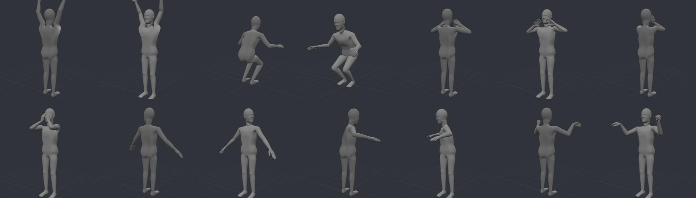

### blank material — joint close-ups

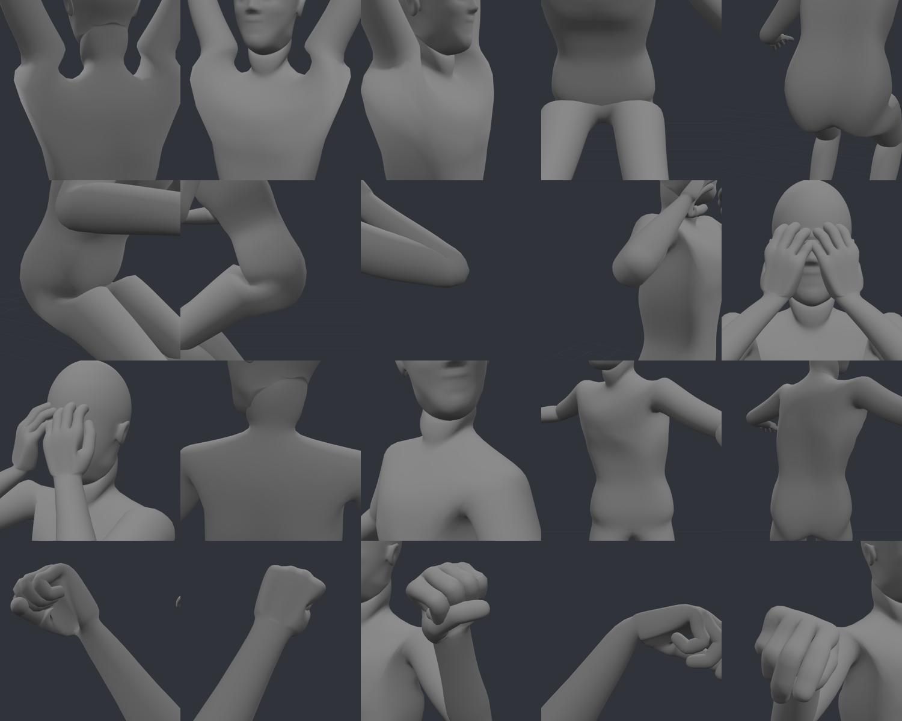

### checker material — test poses (2 angles each)

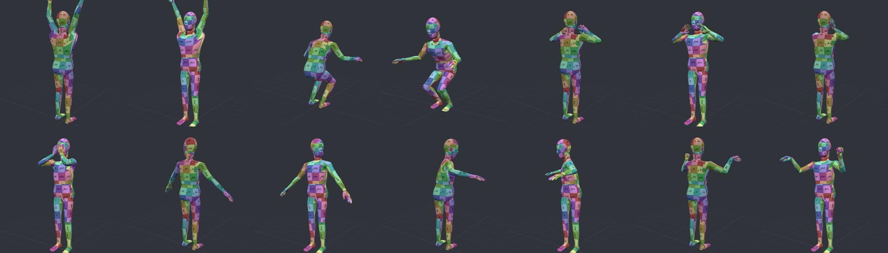

### checker material — joint close-ups

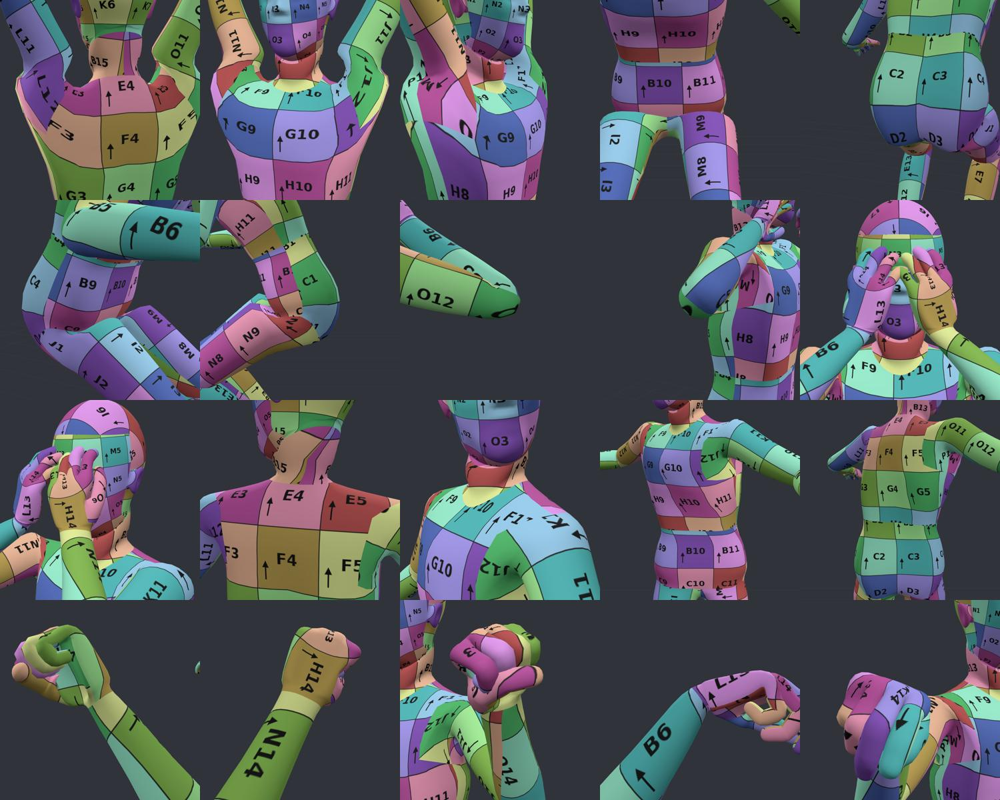

### Viewer-exported GLB reloaded in a fresh page (texture embedded)

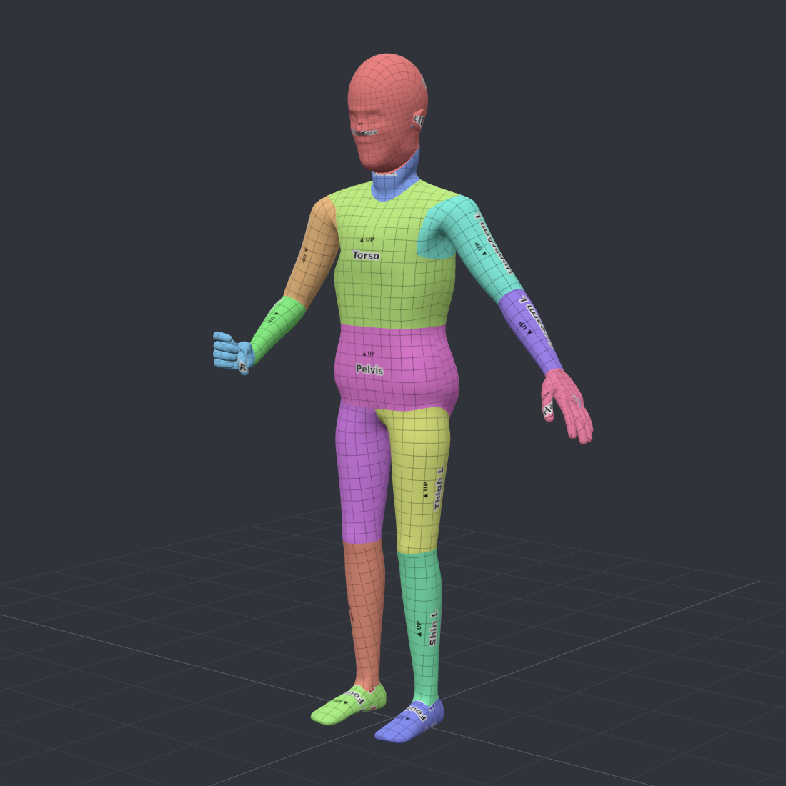

### Projection references + part-ID masks

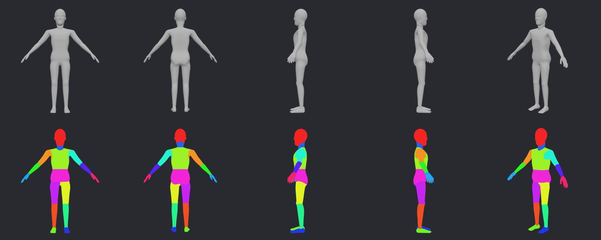

Coverage by the 5 reference views (UV texels): `{"none": 0.0271, "grazing": 0.0669, "one": 0.3869, "multi": 0.519}`; single view alone: `{"front": 0.502, "back": 0.4126, "left": 0.3142, "right": 0.3145, "front_three_quarter": 0.4908}`

## woman_blank — PASS (29/29 checks)

| check | result | detail |
|---|---|---|
| `parts.present` | ✅ | found 16: Foot_L, Foot_R, Forearm_L, Forearm_R, Hand_L, Hand_R, Head, Neck, Pelvis, Shin_L, Shin_R, Thigh_L, Thigh_R, Torso, UpperArm_L, UpperArm_R |
| `skeleton.single` | ✅ | 1 Skeleton objects, 1 distinct joint lists, 63 joints |
| `skeleton.matchesConfig` | ✅ | 63 bones in config |
| `sockets.parented` | ✅ | socket_hand_L_prop->hand_L, socket_hand_R_prop->hand_R, socket_head_accessory->head, socket_back_accessory->chest |
| `clips.named` | ✅ | _qa_pose_cycle, cheer, float_idle, float_monk, float_monk_loop, idle, jump_in_place, pistol_aim, pistol_aim_2h, pistol_fire, pistol_fire_2h, press_detonator, reach_grip_handle, rifle_aim, rifle_fire, run_in_place, staff_idle, staff_stomp, sword_2h_idle, sword_2h_slash, walk_in_place, wave |
| `uv.inRange` | ✅ | 17067 UVs in [0,1] |
| `weights.normalized` | ✅ | max /1-sum/ = 4.10e-8, max influences 4 |
| `seams.boundaryLoops` | ✅ | 375 shared boundary vertices across 17 part pairs |
| `seams.normalsMatch` | ✅ | min dot of boundary normals 1.000000 |
| `seams.noCracksInClips` | ✅ | max gap 0.00e+0 m over 832 frames (null) |
| `bones.lengthsConstant` | ✅ | max length drift 3.12e-6 m (shin_L->foot_L float_monk@1.53) – forearms/shins never shorten |
| `sockets.followBones` | ✅ | max change of socket-in-bone matrix 8.88e-16 |
| `helpers.halfRotation` | ✅ | max /helper - source/2/ = 0.036 deg (shoulder_helper_R idle@1.40) |
| `hand_L.palmFacesBody` | ✅ | palm normal -0.706,-0.708,0 (expected toward the body and down) |
| `hand_L.thumbRadialSide` | ✅ | thumb 0.0202 m in front of index knuckle; index 0.0504 m in front of pinky (A-pose, palms in) |
| `hand_R.palmFacesBody` | ✅ | palm normal 0.706,-0.708,0 (expected toward the body and down) |
| `hand_R.thumbRadialSide` | ✅ | thumb 0.0202 m in front of index knuckle; index 0.0504 m in front of pinky (A-pose, palms in) |
| `grip.noPenetration` | ✅ | 0 hand vertices >1 mm inside the handle (deepest 0.00 mm) |
| `grip.contact` | ✅ | 113 vertices within 4 mm of the handle surface; socket 0.000 mm from the handle axis |
| `clips.extendedSet` | ✅ | 19 clips present |
| `feet.aboveGround` | ✅ | feet at most 0.9 mm below the rest ground plane in game clips (float_monk@0.60s); _qa_ stress poses excluded |
| `float.hovers` | ✅ | float_idle 0.185 m, float_monk_loop 0.669 m, float_monk(end) 0.697 m |
| `locomotion.inPlace` | ✅ | jump_in_place pelvis drift 0.024 m, run_in_place pelvis drift 0.011 m, walk_in_place pelvis drift 0.023 m |
| `weapons.twoHandGrip` | ✅ | support hand within 0.001 mm of the prop's grip_L marker on every frame (worst rifle_aim@0.07s) |
| `weapons.gripNoPenetration` | ✅ | deepest hand vertex 2.28 mm inside a grip (press_detonator hand R) |
| `weapons.gripContact` | ✅ | min 140 hand vertices within 4 mm of each grip |
| `props.noBodyPenetration` | ✅ | deepest prop point -7.8 mm outside the skin (sword_2h_slash@1.47s) |
| `staff.planted` | ✅ | idle butt within 2.4 mm of the floor; stomp lifts 19.2 cm and lands 2.4 mm from the floor (never below 2.4 mm) |
| `press.contact` | ✅ | thumb pad 0.00 mm from the button top at contact; pressed 5.01 mm (travel 5.0 mm); clear of the button before the press |

**Viewer export → fresh reload:** PASS (30/30 checks; material {'type': 'MeshStandardMaterial', 'hasMap': True, 'mapSize': [2048, 2048]})

Boundary vertices per part pair: `{"Foot_L+Shin_L": 24, "Foot_R+Shin_R": 24, "Forearm_L+UpperArm_L": 24, "Forearm_L+Hand_L": 24, "Forearm_R+UpperArm_R": 24, "Forearm_R+Hand_R": 24, "Head+Neck": 32, "Neck+Torso": 32, "Pelvis+Thigh_L+Thigh_R": 2, "Pelvis+Thigh_L": 15, "Pelvis+Thigh_R": 15, "Pelvis+Torso": 32, "Shin_L+Thigh_L": 24, "Shin_R+Thigh_R": 24, "Thigh_L+Thigh_R": 7, "Torso+UpperArm_L": 24, "Torso+UpperArm_R": 24}`

Grip: `{"holdTime": 2.2666666666666666, "verticesInsideHandle": 0, "deepest_mm": 0, "contactVertices": 113, "socketToAxis_mm": 0}` · Press: `{"thumbAboveButtonAtContact_mm": 0, "pressDepth_mm": 5.01, "travel_mm": 5, "thumbAboveButtonWhenRaised_mm": null}`

### blank material — test poses (2 angles each)

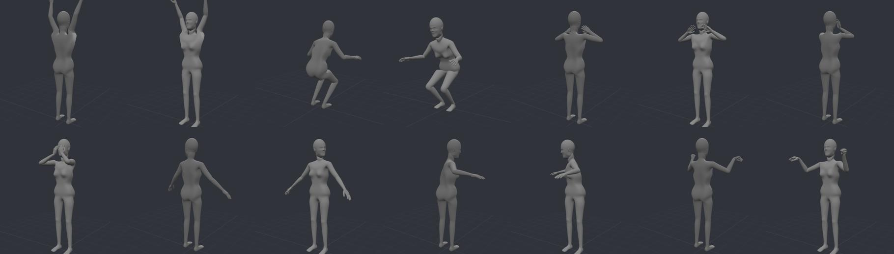

### blank material — joint close-ups

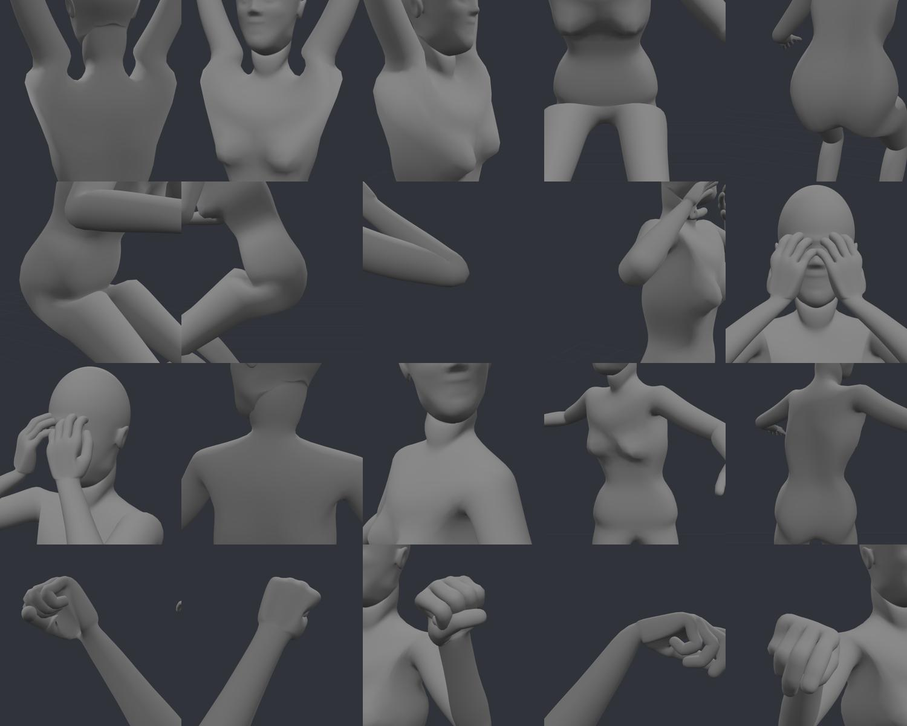

### checker material — test poses (2 angles each)

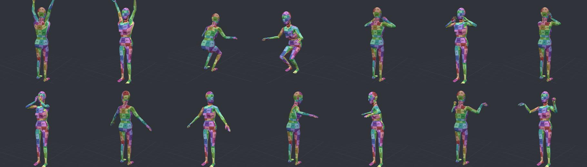

### checker material — joint close-ups

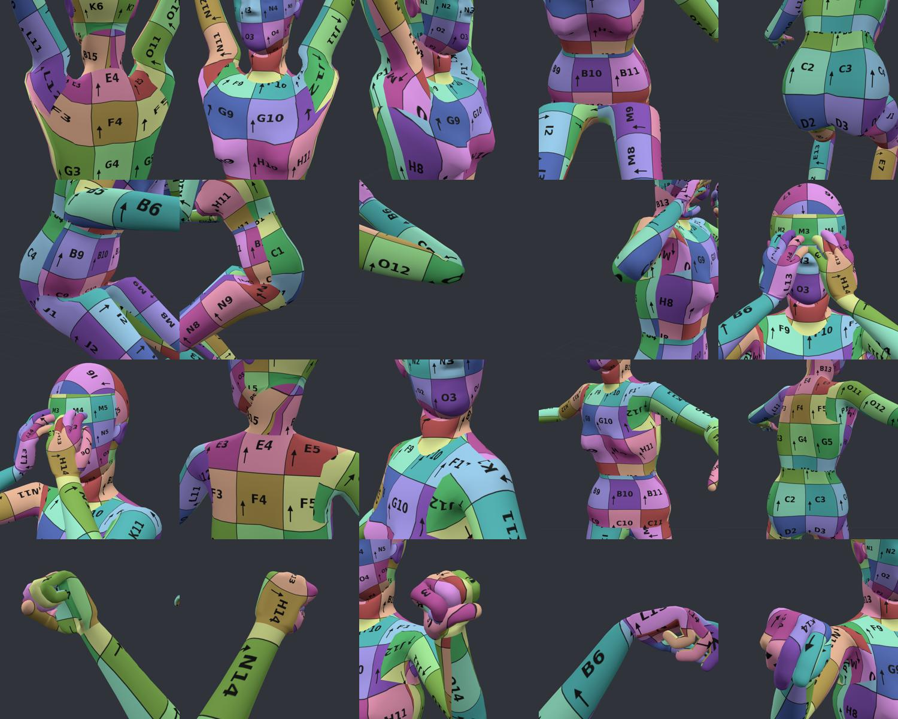

### Viewer-exported GLB reloaded in a fresh page (texture embedded)

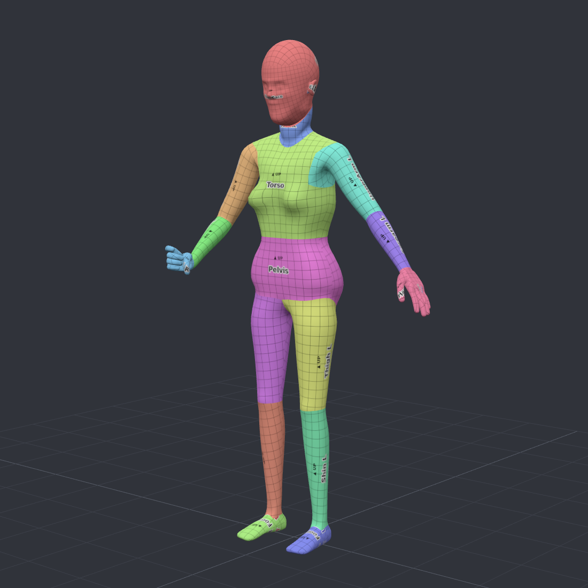

### Projection references + part-ID masks

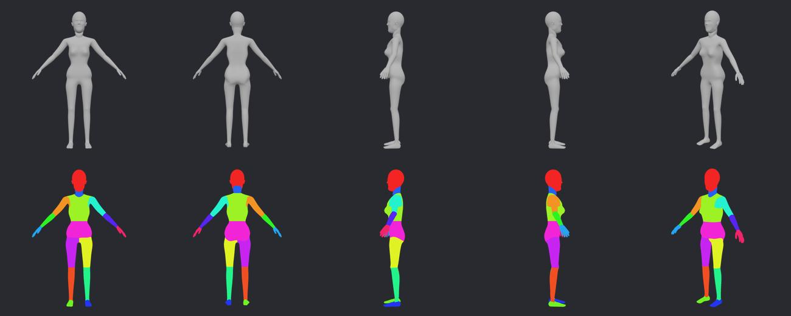

Coverage by the 5 reference views (UV texels): `{"none": 0.0244, "grazing": 0.0633, "one": 0.3904, "multi": 0.5219}`; single view alone: `{"front": 0.5041, "back": 0.4147, "left": 0.3184, "right": 0.3186, "front_three_quarter": 0.4918}`

## dwarf_blank — PASS (29/29 checks)

| check | result | detail |
|---|---|---|
| `parts.present` | ✅ | found 16: Foot_L, Foot_R, Forearm_L, Forearm_R, Hand_L, Hand_R, Head, Neck, Pelvis, Shin_L, Shin_R, Thigh_L, Thigh_R, Torso, UpperArm_L, UpperArm_R |
| `skeleton.single` | ✅ | 1 Skeleton objects, 1 distinct joint lists, 63 joints |
| `skeleton.matchesConfig` | ✅ | 63 bones in config |
| `sockets.parented` | ✅ | socket_hand_L_prop->hand_L, socket_hand_R_prop->hand_R, socket_head_accessory->head, socket_back_accessory->chest |
| `clips.named` | ✅ | _qa_pose_cycle, cheer, float_idle, float_monk, float_monk_loop, idle, jump_in_place, pistol_aim, pistol_aim_2h, pistol_fire, pistol_fire_2h, press_detonator, reach_grip_handle, rifle_aim, rifle_fire, run_in_place, staff_idle, staff_stomp, sword_2h_idle, sword_2h_slash, walk_in_place, wave |
| `uv.inRange` | ✅ | 17067 UVs in [0,1] |
| `weights.normalized` | ✅ | max /1-sum/ = 4.38e-8, max influences 4 |
| `seams.boundaryLoops` | ✅ | 375 shared boundary vertices across 17 part pairs |
| `seams.normalsMatch` | ✅ | min dot of boundary normals 1.000000 |
| `seams.noCracksInClips` | ✅ | max gap 0.00e+0 m over 832 frames (null) |
| `bones.lengthsConstant` | ✅ | max length drift 2.07e-6 m (shin_R->foot_R float_monk@1.73) – forearms/shins never shorten |
| `sockets.followBones` | ✅ | max change of socket-in-bone matrix 6.66e-16 |
| `helpers.halfRotation` | ✅ | max /helper - source/2/ = 0.034 deg (shoulder_helper_R idle@3.40) |
| `hand_L.palmFacesBody` | ✅ | palm normal -0.706,-0.708,0 (expected toward the body and down) |
| `hand_L.thumbRadialSide` | ✅ | thumb 0.0243 m in front of index knuckle; index 0.0605 m in front of pinky (A-pose, palms in) |
| `hand_R.palmFacesBody` | ✅ | palm normal 0.706,-0.708,0 (expected toward the body and down) |
| `hand_R.thumbRadialSide` | ✅ | thumb 0.0243 m in front of index knuckle; index 0.0605 m in front of pinky (A-pose, palms in) |
| `grip.noPenetration` | ✅ | 0 hand vertices >1 mm inside the handle (deepest 0.00 mm) |
| `grip.contact` | ✅ | 60 vertices within 4 mm of the handle surface; socket 0.000 mm from the handle axis |
| `clips.extendedSet` | ✅ | 19 clips present |
| `feet.aboveGround` | ✅ | feet at most 3.3 mm below the rest ground plane in game clips (float_monk@0.60s); _qa_ stress poses excluded |
| `float.hovers` | ✅ | float_idle 0.117 m, float_monk_loop 0.402 m, float_monk(end) 0.426 m |
| `locomotion.inPlace` | ✅ | jump_in_place pelvis drift 0.02 m, run_in_place pelvis drift 0.01 m, walk_in_place pelvis drift 0.019 m |
| `weapons.twoHandGrip` | ✅ | support hand within 0.001 mm of the prop's grip_L marker on every frame (worst rifle_fire@0.80s) |
| `weapons.gripNoPenetration` | ✅ | deepest hand vertex 1.23 mm inside a grip (pistol_aim_2h hand L) |
| `weapons.gripContact` | ✅ | min 60 hand vertices within 4 mm of each grip |
| `props.noBodyPenetration` | ✅ | deepest prop point -5.3 mm outside the skin (sword_2h_slash@1.53s) |
| `staff.planted` | ✅ | idle butt within 2.7 mm of the floor; stomp lifts 10.4 cm and lands 2.7 mm from the floor (never below 2.7 mm) |
| `press.contact` | ✅ | thumb pad -0.03 mm from the button top at contact; pressed 5.01 mm (travel 5.0 mm); clear of the button before the press |

**Viewer export → fresh reload:** PASS (30/30 checks; material {'type': 'MeshStandardMaterial', 'hasMap': True, 'mapSize': [2048, 2048]})

Boundary vertices per part pair: `{"Foot_L+Shin_L": 24, "Foot_R+Shin_R": 24, "Forearm_L+UpperArm_L": 24, "Forearm_L+Hand_L": 24, "Forearm_R+UpperArm_R": 24, "Forearm_R+Hand_R": 24, "Head+Neck": 32, "Neck+Torso": 32, "Pelvis+Thigh_L+Thigh_R": 2, "Pelvis+Thigh_L": 15, "Pelvis+Thigh_R": 15, "Pelvis+Torso": 32, "Shin_L+Thigh_L": 24, "Shin_R+Thigh_R": 24, "Thigh_L+Thigh_R": 7, "Torso+UpperArm_L": 24, "Torso+UpperArm_R": 24}`

Grip: `{"holdTime": 2.2666666666666666, "verticesInsideHandle": 0, "deepest_mm": 0, "contactVertices": 60, "socketToAxis_mm": 0}` · Press: `{"thumbAboveButtonAtContact_mm": -0.03, "pressDepth_mm": 5.01, "travel_mm": 5, "thumbAboveButtonWhenRaised_mm": null}`

### blank material — test poses (2 angles each)

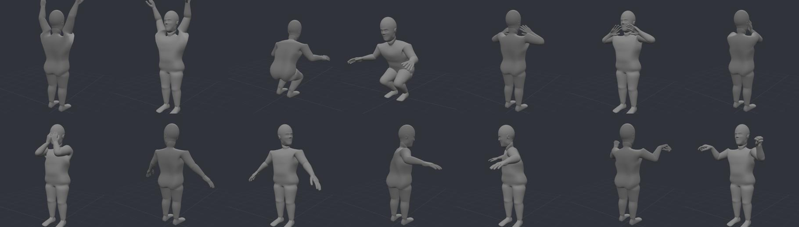

### blank material — joint close-ups

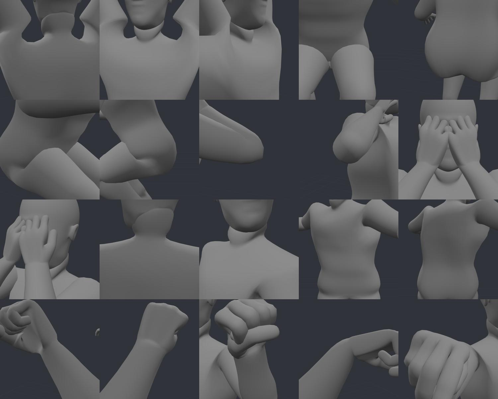

### checker material — test poses (2 angles each)

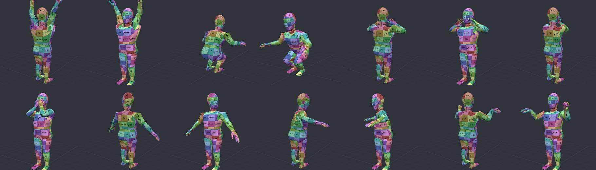

### checker material — joint close-ups

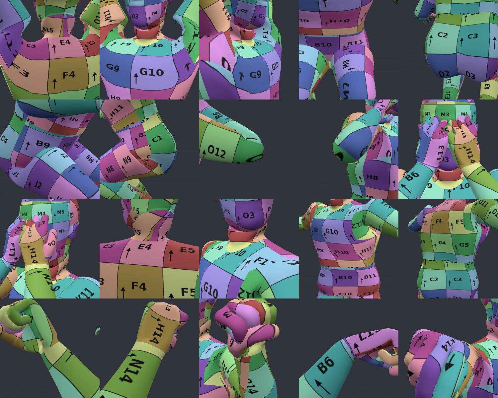

### Viewer-exported GLB reloaded in a fresh page (texture embedded)

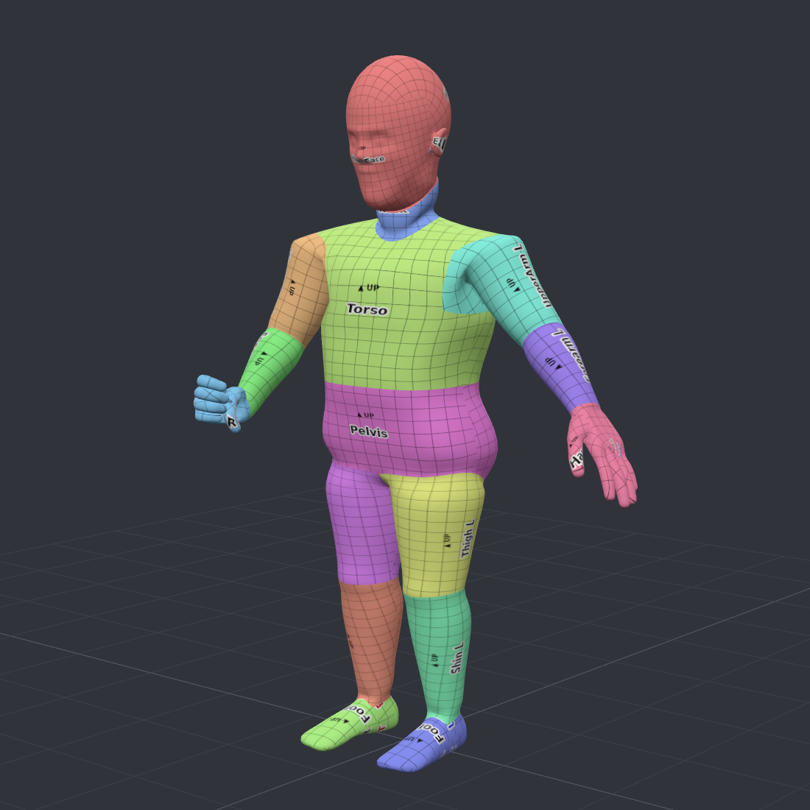

### Projection references + part-ID masks

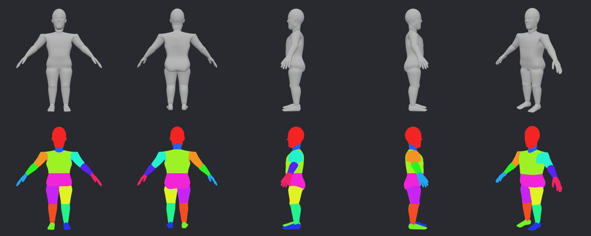

Coverage by the 5 reference views (UV texels): `{"none": 0.0377, "grazing": 0.0751, "one": 0.3839, "multi": 0.5033}`; single view alone: `{"front": 0.4945, "back": 0.405, "left": 0.3057, "right": 0.3058, "front_three_quarter": 0.4775}`

## stocky_test — PASS (29/29 checks)

| check | result | detail |
|---|---|---|
| `parts.present` | ✅ | found 16: Foot_L, Foot_R, Forearm_L, Forearm_R, Hand_L, Hand_R, Head, Neck, Pelvis, Shin_L, Shin_R, Thigh_L, Thigh_R, Torso, UpperArm_L, UpperArm_R |
| `skeleton.single` | ✅ | 1 Skeleton objects, 1 distinct joint lists, 63 joints |
| `skeleton.matchesConfig` | ✅ | 63 bones in config |
| `sockets.parented` | ✅ | socket_hand_L_prop->hand_L, socket_hand_R_prop->hand_R, socket_head_accessory->head, socket_back_accessory->chest |
| `clips.named` | ✅ | _qa_pose_cycle, cheer, float_idle, float_monk, float_monk_loop, idle, jump_in_place, pistol_aim, pistol_aim_2h, pistol_fire, pistol_fire_2h, press_detonator, reach_grip_handle, rifle_aim, rifle_fire, run_in_place, staff_idle, staff_stomp, sword_2h_idle, sword_2h_slash, walk_in_place, wave |
| `uv.inRange` | ✅ | 17067 UVs in [0,1] |
| `weights.normalized` | ✅ | max /1-sum/ = 4.47e-8, max influences 4 |
| `seams.boundaryLoops` | ✅ | 375 shared boundary vertices across 17 part pairs |
| `seams.normalsMatch` | ✅ | min dot of boundary normals 1.000000 |
| `seams.noCracksInClips` | ✅ | max gap 0.00e+0 m over 832 frames (null) |
| `bones.lengthsConstant` | ✅ | max length drift 2.44e-6 m (shin_L->foot_L float_monk@1.67) – forearms/shins never shorten |
| `sockets.followBones` | ✅ | max change of socket-in-bone matrix 8.88e-16 |
| `helpers.halfRotation` | ✅ | max /helper - source/2/ = 0.023 deg (shoulder_helper_R idle@3.40) |
| `hand_L.palmFacesBody` | ✅ | palm normal -0.706,-0.708,0 (expected toward the body and down) |
| `hand_L.thumbRadialSide` | ✅ | thumb 0.0254 m in front of index knuckle; index 0.0633 m in front of pinky (A-pose, palms in) |
| `hand_R.palmFacesBody` | ✅ | palm normal 0.706,-0.708,0 (expected toward the body and down) |
| `hand_R.thumbRadialSide` | ✅ | thumb 0.0254 m in front of index knuckle; index 0.0633 m in front of pinky (A-pose, palms in) |
| `grip.noPenetration` | ✅ | 0 hand vertices >1 mm inside the handle (deepest 0.00 mm) |
| `grip.contact` | ✅ | 65 vertices within 4 mm of the handle surface; socket 0.000 mm from the handle axis |
| `clips.extendedSet` | ✅ | 19 clips present |
| `feet.aboveGround` | ✅ | feet at most 2.6 mm below the rest ground plane in game clips (float_monk@0.60s); _qa_ stress poses excluded |
| `float.hovers` | ✅ | float_idle 0.166 m, float_monk_loop 0.591 m, float_monk(end) 0.621 m |
| `locomotion.inPlace` | ✅ | jump_in_place pelvis drift 0.025 m, run_in_place pelvis drift 0.012 m, walk_in_place pelvis drift 0.023 m |
| `weapons.twoHandGrip` | ✅ | support hand within 0.001 mm of the prop's grip_L marker on every frame (worst pistol_fire_2h@0.40s) |
| `weapons.gripNoPenetration` | ✅ | deepest hand vertex 2.07 mm inside a grip (pistol_aim_2h hand L) |
| `weapons.gripContact` | ✅ | min 46 hand vertices within 4 mm of each grip |
| `props.noBodyPenetration` | ✅ | deepest prop point -9.9 mm outside the skin (sword_2h_slash@1.73s) |
| `staff.planted` | ✅ | idle butt within 2.9 mm of the floor; stomp lifts 19.3 cm and lands 2.9 mm from the floor (never below 2.9 mm) |
| `press.contact` | ✅ | thumb pad -0.03 mm from the button top at contact; pressed 5.06 mm (travel 5.0 mm); clear of the button before the press |

**Viewer export → fresh reload:** PASS (30/30 checks; material {'type': 'MeshStandardMaterial', 'hasMap': True, 'mapSize': [2048, 2048]})

Boundary vertices per part pair: `{"Foot_L+Shin_L": 24, "Foot_R+Shin_R": 24, "Forearm_L+UpperArm_L": 24, "Forearm_L+Hand_L": 24, "Forearm_R+UpperArm_R": 24, "Forearm_R+Hand_R": 24, "Head+Neck": 32, "Neck+Torso": 32, "Pelvis+Thigh_L+Thigh_R": 2, "Pelvis+Thigh_L": 15, "Pelvis+Thigh_R": 15, "Pelvis+Torso": 32, "Shin_L+Thigh_L": 24, "Shin_R+Thigh_R": 24, "Thigh_L+Thigh_R": 7, "Torso+UpperArm_L": 24, "Torso+UpperArm_R": 24}`

Grip: `{"holdTime": 2.2666666666666666, "verticesInsideHandle": 0, "deepest_mm": 0, "contactVertices": 65, "socketToAxis_mm": 0}` · Press: `{"thumbAboveButtonAtContact_mm": -0.03, "pressDepth_mm": 5.06, "travel_mm": 5, "thumbAboveButtonWhenRaised_mm": null}`

### blank material — test poses (2 angles each)

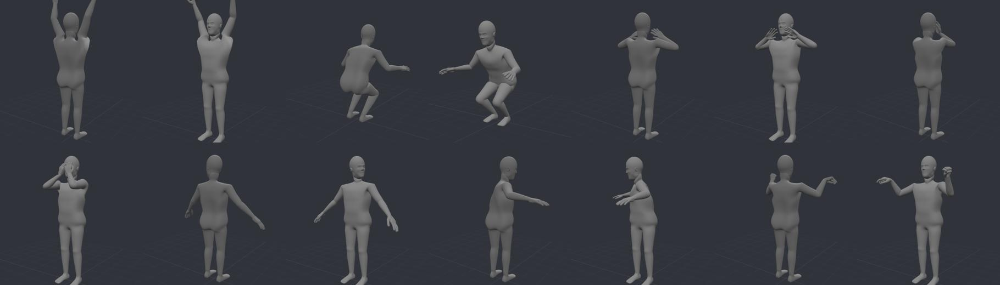

### blank material — joint close-ups

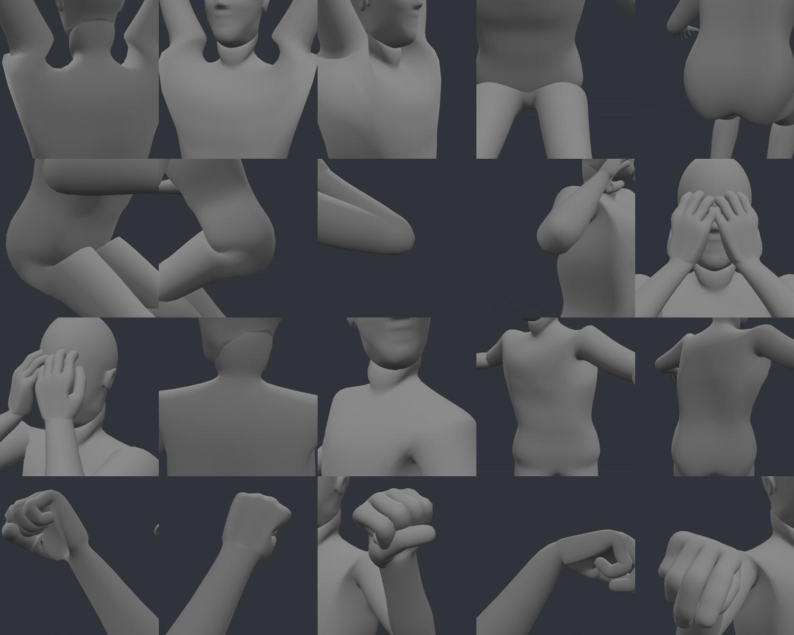

### checker material — test poses (2 angles each)

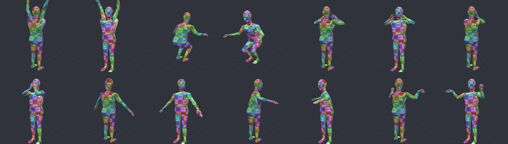

### checker material — joint close-ups

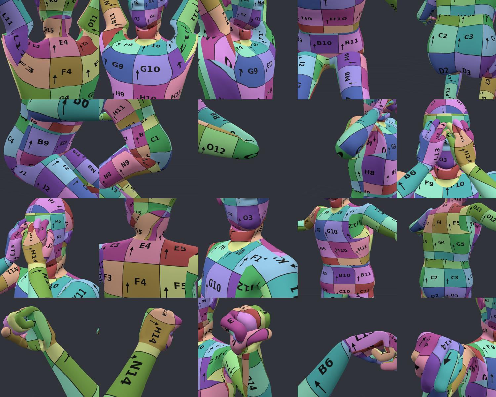

### Viewer-exported GLB reloaded in a fresh page (texture embedded)

### Projection references + part-ID masks

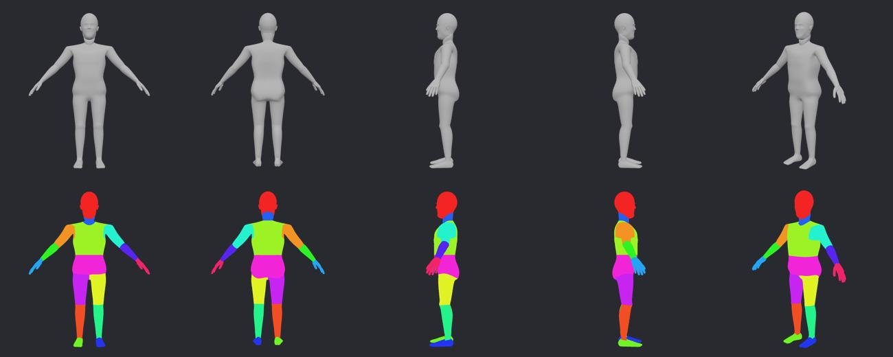

Coverage by the 5 reference views (UV texels): `{"none": 0.0314, "grazing": 0.068, "one": 0.3873, "multi": 0.5133}`; single view alone: `{"front": 0.4981, "back": 0.409, "left": 0.3127, "right": 0.3128, "front_three_quarter": 0.4863}`

## diag_textured_test — PASS (30/30 checks)

| check | result | detail |
|---|---|---|
| `parts.present` | ✅ | found 16: Foot_L, Foot_R, Forearm_L, Forearm_R, Hand_L, Hand_R, Head, Neck, Pelvis, Shin_L, Shin_R, Thigh_L, Thigh_R, Torso, UpperArm_L, UpperArm_R |
| `skeleton.single` | ✅ | 1 Skeleton objects, 1 distinct joint lists, 63 joints |
| `skeleton.matchesConfig` | ✅ | 63 bones in config |
| `sockets.parented` | ✅ | socket_hand_L_prop->hand_L, socket_hand_R_prop->hand_R, socket_head_accessory->head, socket_back_accessory->chest |
| `clips.named` | ✅ | _qa_pose_cycle, cheer, float_idle, float_monk, float_monk_loop, idle, jump_in_place, pistol_aim, pistol_aim_2h, pistol_fire, pistol_fire_2h, press_detonator, reach_grip_handle, rifle_aim, rifle_fire, run_in_place, staff_idle, staff_stomp, sword_2h_idle, sword_2h_slash, walk_in_place, wave |
| `uv.inRange` | ✅ | 17067 UVs in [0,1] |
| `weights.normalized` | ✅ | max /1-sum/ = 4.47e-8, max influences 4 |
| `material.texture` | ✅ | {"type":"MeshStandardMaterial","hasMap":true,"mapSize":[2048,2048]} |
| `seams.boundaryLoops` | ✅ | 375 shared boundary vertices across 17 part pairs |
| `seams.normalsMatch` | ✅ | min dot of boundary normals 1.000000 |
| `seams.noCracksInClips` | ✅ | max gap 0.00e+0 m over 832 frames (null) |
| `bones.lengthsConstant` | ✅ | max length drift 2.44e-6 m (shin_L->foot_L float_monk@1.67) – forearms/shins never shorten |
| `sockets.followBones` | ✅ | max change of socket-in-bone matrix 8.88e-16 |
| `helpers.halfRotation` | ✅ | max /helper - source/2/ = 0.023 deg (shoulder_helper_R idle@3.40) |
| `hand_L.palmFacesBody` | ✅ | palm normal -0.706,-0.708,0 (expected toward the body and down) |
| `hand_L.thumbRadialSide` | ✅ | thumb 0.0254 m in front of index knuckle; index 0.0633 m in front of pinky (A-pose, palms in) |
| `hand_R.palmFacesBody` | ✅ | palm normal 0.706,-0.708,0 (expected toward the body and down) |
| `hand_R.thumbRadialSide` | ✅ | thumb 0.0254 m in front of index knuckle; index 0.0633 m in front of pinky (A-pose, palms in) |
| `grip.noPenetration` | ✅ | 0 hand vertices >1 mm inside the handle (deepest 0.00 mm) |
| `grip.contact` | ✅ | 65 vertices within 4 mm of the handle surface; socket 0.000 mm from the handle axis |
| `clips.extendedSet` | ✅ | 19 clips present |
| `feet.aboveGround` | ✅ | feet at most 2.6 mm below the rest ground plane in game clips (float_monk@0.60s); _qa_ stress poses excluded |
| `float.hovers` | ✅ | float_idle 0.166 m, float_monk_loop 0.591 m, float_monk(end) 0.621 m |
| `locomotion.inPlace` | ✅ | jump_in_place pelvis drift 0.025 m, run_in_place pelvis drift 0.012 m, walk_in_place pelvis drift 0.023 m |
| `weapons.twoHandGrip` | ✅ | support hand within 0.001 mm of the prop's grip_L marker on every frame (worst pistol_fire_2h@0.40s) |
| `weapons.gripNoPenetration` | ✅ | deepest hand vertex 2.07 mm inside a grip (pistol_aim_2h hand L) |
| `weapons.gripContact` | ✅ | min 46 hand vertices within 4 mm of each grip |
| `props.noBodyPenetration` | ✅ | deepest prop point -9.9 mm outside the skin (sword_2h_slash@1.73s) |
| `staff.planted` | ✅ | idle butt within 2.9 mm of the floor; stomp lifts 19.3 cm and lands 2.9 mm from the floor (never below 2.9 mm) |
| `press.contact` | ✅ | thumb pad -0.03 mm from the button top at contact; pressed 5.06 mm (travel 5.0 mm); clear of the button before the press |

**Viewer export → fresh reload:** PASS (30/30 checks; material {'type': 'MeshStandardMaterial', 'hasMap': True, 'mapSize': [2048, 2048]})

Boundary vertices per part pair: `{"Foot_L+Shin_L": 24, "Foot_R+Shin_R": 24, "Forearm_L+UpperArm_L": 24, "Forearm_L+Hand_L": 24, "Forearm_R+UpperArm_R": 24, "Forearm_R+Hand_R": 24, "Head+Neck": 32, "Neck+Torso": 32, "Pelvis+Thigh_L+Thigh_R": 2, "Pelvis+Thigh_L": 15, "Pelvis+Thigh_R": 15, "Pelvis+Torso": 32, "Shin_L+Thigh_L": 24, "Shin_R+Thigh_R": 24, "Thigh_L+Thigh_R": 7, "Torso+UpperArm_L": 24, "Torso+UpperArm_R": 24}`

Grip: `{"holdTime": 2.2666666666666666, "verticesInsideHandle": 0, "deepest_mm": 0, "contactVertices": 65, "socketToAxis_mm": 0}` · Press: `{"thumbAboveButtonAtContact_mm": -0.03, "pressDepth_mm": 5.06, "travel_mm": 5, "thumbAboveButtonWhenRaised_mm": null}`

### original material — test poses (2 angles each)

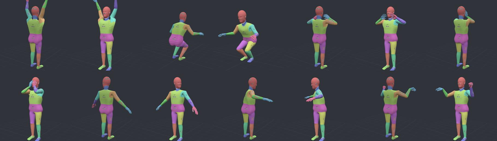

### original material — joint close-ups

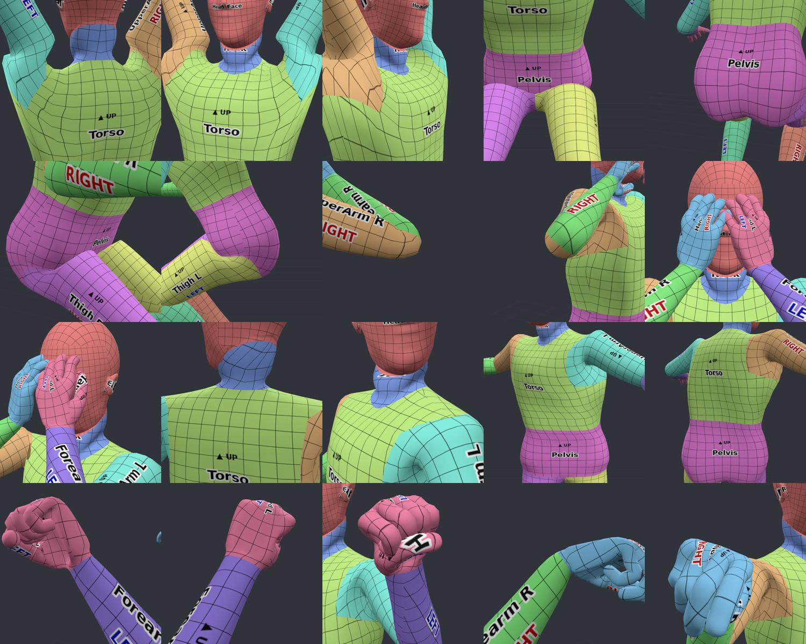

### checker material — test poses (2 angles each)

### checker material — joint close-ups

### Viewer-exported GLB reloaded in a fresh page (texture embedded)

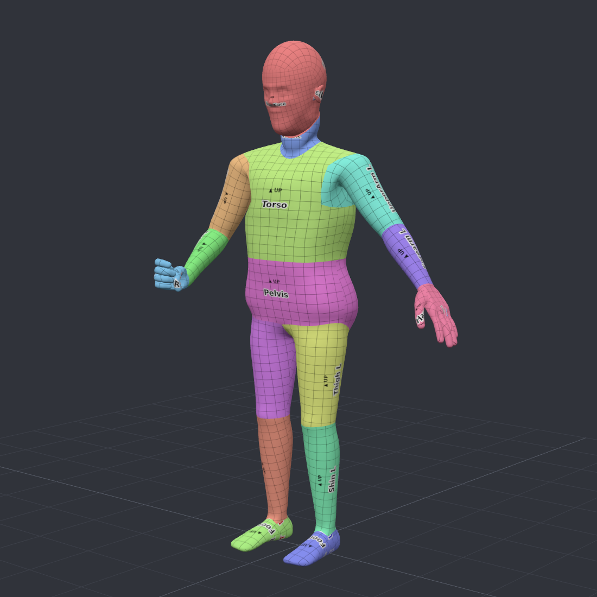

### Projection references + part-ID masks

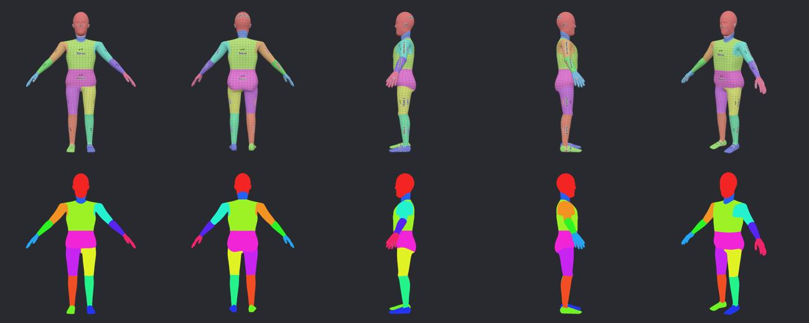

Coverage by the 5 reference views (UV texels): `{"none": 0.0314, "grazing": 0.068, "one": 0.3873, "multi": 0.5133}`; single view alone: `{"front": 0.4981, "back": 0.409, "left": 0.3127, "right": 0.3128, "front_three_quarter": 0.4863}`
